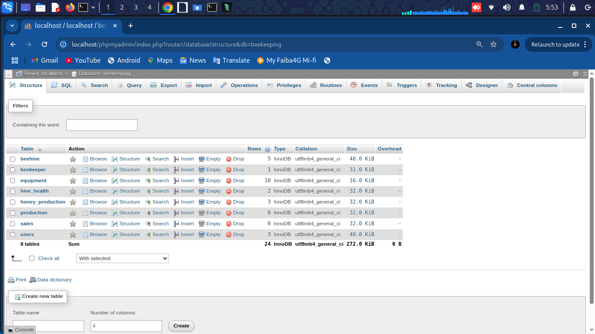
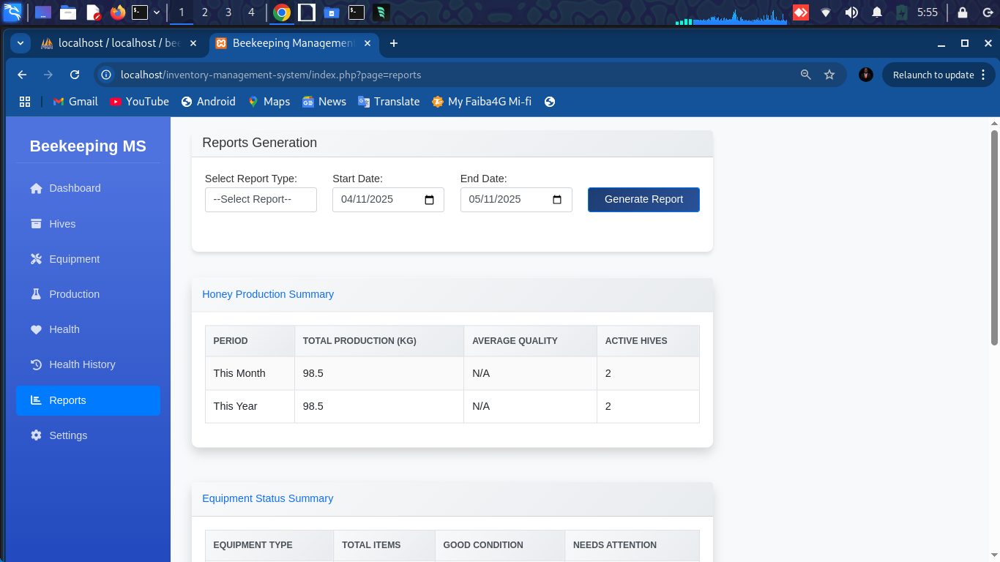
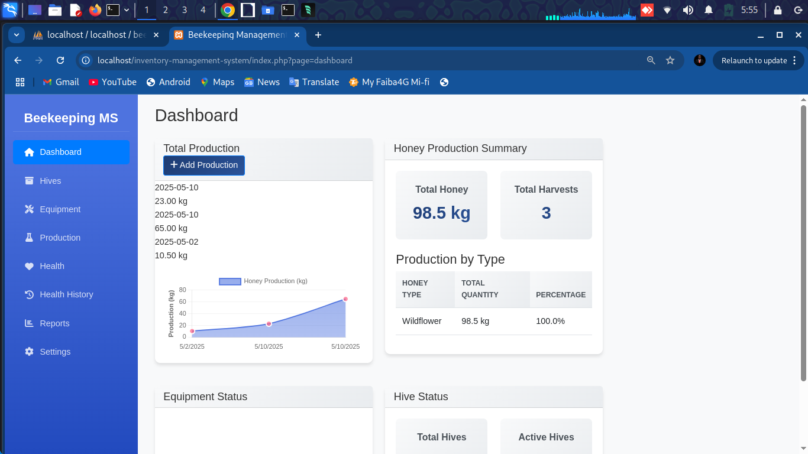
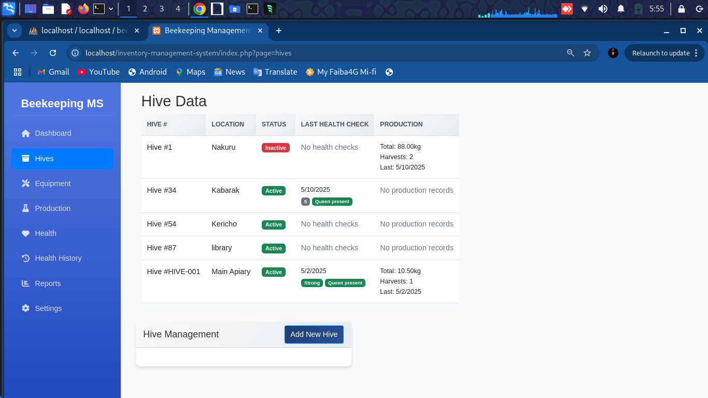
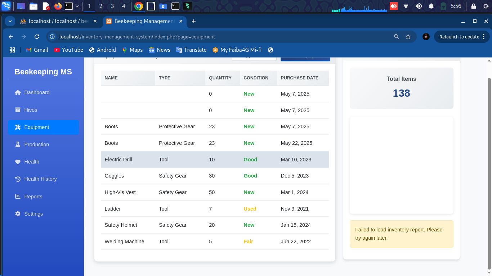

# 🐝 Beekeeping Inventory Management System

[](https://php.net/)
[](https://getbootstrap.com/)
[](https://jquery.com/)
[](https://opensource.org/licenses/MIT)

A comprehensive web-based inventory management system designed specifically for beekeeping operations. Track your hives, monitor equipment, record production, and maintain hive health records all in one place.


## ✨ Features

### 📊 Dashboard
- Real-time overview of your apiary
- Production summaries and trends
- Equipment status at a glance
- Quick access to important metrics

### 🏡 Hive Management
- Track multiple hives with detailed records
- Record hive inspections and observations
- Monitor colony strength and queen status
- Historical data tracking

### 🛠️ Equipment Tracking
- Inventory management for all beekeeping equipment
- Maintenance scheduling
- Condition monitoring
- Purchase history and depreciation tracking

### 🍯 Production Monitoring
- Record honey yields and other products
- Track harvest dates and quantities
- Quality assessment tools
- Production analytics

### 🏥 Hive Health
- Health check scheduling
- Disease and pest tracking
- Treatment records
- Health analytics and reporting

## 📸 Screenshots

<div align="center">
  
  
  
  
  
</div>

## 🚀 Getting Started

### Prerequisites
- PHP 7.4 or higher
- MySQL 5.7 or higher
- Web server (Apache/Nginx)

### Installation

1. **Clone the repository**
   ```bash
   git clone https://github.com/OnpointSoftwares/Bee-Keeping-Inventory.git
   cd Bee-Keeping-Inventory
   ```

2. **Configure the database**
   - Import the database schema from `database/schema.sql`
   - Update `config/database.php` with your database credentials

3. **Set up the web server**
   - Point your web server to the project root directory
   - Ensure `storage/` directory is writable

4. **Access the application**
   - Open your browser and navigate to the application URL
   - Default login: admin@example.com / password

## 🛠️ Tech Stack

- **Backend**: PHP 7.4+
- **Frontend**: HTML5, CSS3, JavaScript
- **Database**: MySQL 5.7+
- **Frameworks & Libraries**:
  - Bootstrap 5.2.3
  - jQuery 3.6.0
  - Chart.js 3.9.1
  - Font Awesome 6.4.0

## 📂 Project Structure

```
beekeeping-inventory/
├── assets/               # Static assets
│   ├── css/              # Stylesheets
│   ├── js/               # JavaScript files
│   └── images/           # Image assets
├── config/               # Configuration files
├── includes/             # PHP includes
│   ├── header/           # Header components
│   ├── modals/           # Modal dialogs
│   └── sections/         # Page sections
├── utils/                # Utility classes
└── index.php             # Main entry point
```

## 📝 License

This project is licensed under the MIT License - see the [LICENSE](LICENSE) file for details.

## 🤝 Contributing

Contributions are welcome! Please read our [contributing guidelines](CONTRIBUTING.md) to get started.

## 📬 Contact

For any questions or feedback, please contact us at:
- Email: support@beekeeping-inventory.com
- GitHub Issues: [Open an Issue](https://github.com/OnpointSoftwares/Bee-Keeping-Inventory/issues)

---

<div align="center">
  Made with ❤️ for beekeepers everywhere
</div>
